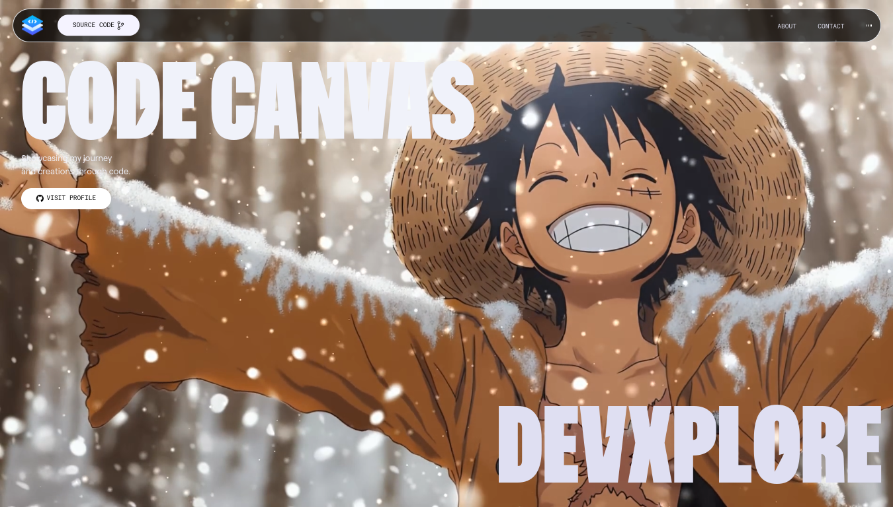

# My Portfolio Website 🌐



Welcome to my **Portfolio Website** repository! This project showcases my personal and professional work through a modern and responsive design built with **React**, **Vite**, **TailwindCSS**, and **GSAP**. 💻✨

## 🛠️ Technologies Used

- **React**: A JavaScript library for building user interfaces.
- **Vite**: A next-generation frontend tooling for faster development.
- **TailwindCSS**: A utility-first CSS framework for styling.
- **GSAP**: A robust JavaScript animation library.

## 🚀 Getting Started

Follow these steps to get started with the project:

1. **Clone the repository:**
   ```bash
   git clone https://github.com/lostluffyz/portfolio.git
   ```

2. **Navigate to the project directory:**
   ```bash
   cd portfolio
   ```

3. **Install dependencies:**
   ```bash
   npm install
   ```

4. **Run the development server:**
   ```bash
   npm run dev
   ```

5. Open your browser and go to `http://localhost:5173` to see the website in action! 🌟

## 🌟 Features

- 🌐 **Showcase your work** with a modern portfolio layout.
- 🎨 **Customizable and responsive design** using TailwindCSS.
- ✨ **Engaging animations** powered by GSAP.
- 📱 **Mobile-first design** to look great on all devices.

## 🤝 Contributing

Contributions are welcome! If you have ideas to make this project better:

1. Fork the repository.
2. Create a new branch for your feature.
3. Submit a pull request with your changes.

Made with ❤️ by [lostluffyz](https://github.com/lostluffyz)

🌟 If you like this project, don’t forget to give it a star! 🌟

